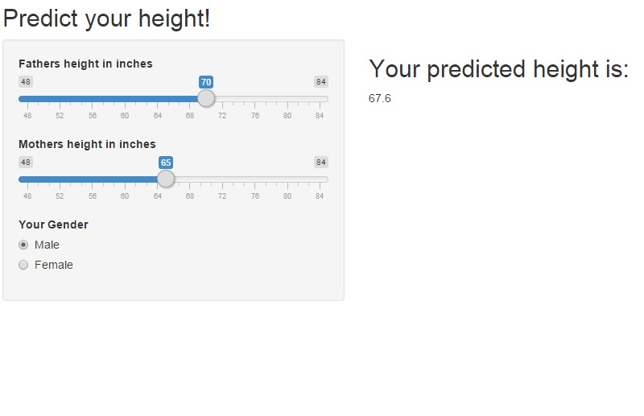
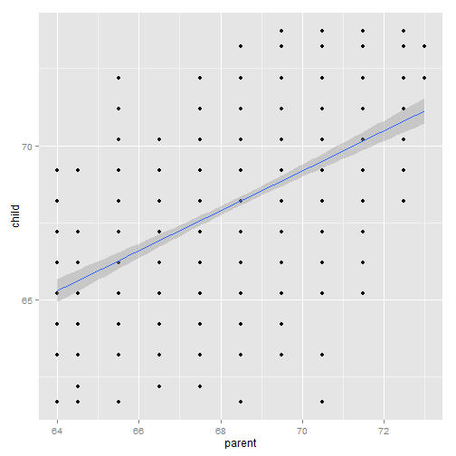

## Using the Application

This is a simple application to predict a person's height based on the average of their parents height and their gender. 

1. Use the Slider to select your father's height.
2. Use the Slider to select your mother's height.
3. Select your gender.

---

## The Application

The interface is clean and simple, the output is easy to understand!

<div style='text-align: center;'>
    
</div>


--- 

## The Science!

The App uses a simple linear model based on the Galton data set in R. The calculation in the app is quite simple.  I fit a linear model to the Galton data set:

lm(galton$child ~ galton$parent)

I averaged the input heights of the father and mother, then applied the slope and y intercept from the linear model.

I assumed that men are 5% taller than women, so if the gender selected was female, I reduced the estimate by 5%.

---

## Proof of the Science!

The Chart below illustrates the correlation between the height of the parent and the child:

 


---

## Environment Information
This application and document were built with:

```r
print(sessionInfo(), locale = FALSE)
```

```
## R version 3.1.2 (2014-10-31)
## Platform: x86_64-w64-mingw32/x64 (64-bit)
## 
## attached base packages:
## [1] grid      splines   stats     graphics  grDevices utils     datasets 
## [8] methods   base     
## 
## other attached packages:
## [1] rCharts_0.4.5   ggplot2_1.0.0   UsingR_2.0-4    Hmisc_3.14-6   
## [5] Formula_1.2-0   survival_2.37-7 lattice_0.20-29 HistData_0.7-5 
## [9] MASS_7.3-37    
## 
## loaded via a namespace (and not attached):
##  [1] acepack_1.3-3.3     cluster_2.0.1       colorspace_1.2-4   
##  [4] digest_0.6.8        evaluate_0.5.5      foreign_0.8-62     
##  [7] formatR_1.0         gtable_0.1.2        knitr_1.9          
## [10] latticeExtra_0.6-26 markdown_0.7.4      munsell_0.4.2      
## [13] nnet_7.3-8          plyr_1.8.1          proto_0.3-10       
## [16] RColorBrewer_1.1-2  Rcpp_0.11.4         reshape2_1.4.1     
## [19] RJSONIO_1.3-0       rpart_4.1-8         scales_0.2.4       
## [22] slidify_0.4.5       stringr_0.6.2       tools_3.1.2        
## [25] whisker_0.3-2       yaml_2.1.13
```
